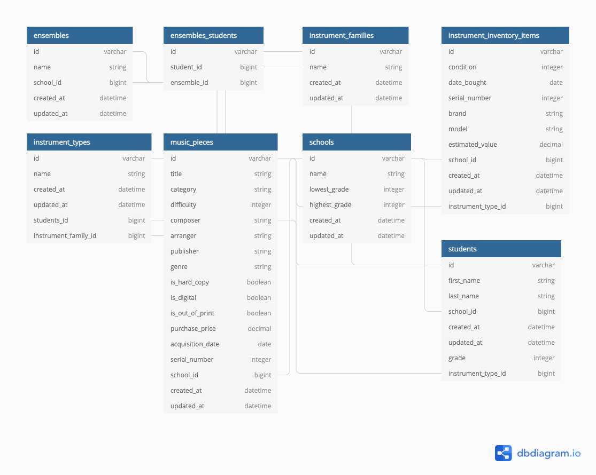

# 🎼 Band Program Content Management System - Backend

This is the backend for my Band Program Content Management System, which is a dashboard to allow band directors to keep all the details and logistics of their band program in one place.

It serves as an API to the [frontend of the project](https://github.com/KatieJessupMcd/band-program-frontend).

🛠 Built with:

- Ruby on Rails
- GraphQL
- Rspec

## 🤔 What problem does this solve?

During my years as an elementary and middle school band director, there was a constant stream of challenges to solve. These included:

- What music pieces do I have in the library for the 7th graders that is the correct difficulty level for them
- I need a quick roster of how many clarinet players are in this school, and how many of those are sixth graders. Sixth graders are notorius for eating their reeds (only half joking) so need to make sure I order enough extra for the year
- I need data to show school admin why I need a certain budget to keep the school instrument inventory in working order. To do that, I need a way to track instrument condition, brand, and value
- The fifth grade trumpets keep emptying their ~~spit valves~~ water valves in less than ideal places, how can I redirect that
- For the spring concert, there are 2 different ensembles performing with 3 different grades across those ensembles. I need a quick way to pull that student contact information to notify parents and homeroom teachers of the upcoming schedule adjustments for rehearsals
- And more!

The problem was, there wasn't really a good system to keep all this information in one place. I tried spreadsheets, Google docs etc. but these solutions were too brittle to maintain, and finding a better way was simply time I did not have. There is a reason some of the best band directors and music teachers I've had the honor of working with have a large color coded binder in one hand and a large cup of coffee in the other- keeping on top of all of these moving parts is necesary and exhausing in this line of work.

_Cut to preset day_
Having changed careers, I can now build the tool that would have saved past Katie a lot of time and energy, and could perhaps help band directors still in the ~~trenches~~ field.

## 📄 Prerequisites

- `ruby 3.0.3`
- `postgresql` server running

> To check your version of Ruby, run `ruby -v`
>
> If the version does not match, run `rbenv install 3.0.3`

## 🚀 How to Run Locally

### Install Dependencies

```
git clone https://github.com/KatieJessupMcd/band-program-backend.git
cd band-program-backend
bundle install
```

### Initialize the Database

```
rails db:create db:migrate db:seed
```

### Serve

```
rails s
```

### Test GraphQL Query

Once the server is running, navigate to `http://localhost:3000/graphiql` and test a query with

```
query getStudents {
  students {
    firstName
    lastName
    school {
      name
    }
  }
}
```

### Run Rspec Tests

```
rspec spec/models
```

## 🗄 Models

Planning out the models before I even wrote any code was a large part of this project, starting from thinking about what tables I would want (Ensembles? Lockers? Attendance records? Repair notes?).

- I wrote them all down in a Google doc, and then listed out attributes for each model.
- Eventually, I started to pare down the dozen+ models or so into a core that included tables such as `schools`, `students`, and `ensembles`.
- Then I started considering the relationships between all of them. The most interesting one is the many to many between `students` and `ensembles`, as a student can be enrolled in many ensembles and an ensemble has many students.

Here is a diagram of the models as they stand today:


## 👩‍💻 Interesting Challenges Along the Way

- I was torn between two approches to architecting the full stack project. I knew I wanted React on the front end. In one case, I was considering sticking to the traditional Rails MVC pattern, and then just rendering React inside the views somehow. However, it felt more clean to have React have free reign on the front end, and interact with the backend via Apollo and the API generated by GraphQL and Rails on the backend. However, as I start to build out the front end, I miss the Rails helpers you get for free to interact wiht the models, in particular with forms
- GraphQL syntax shenanigans - I also chose this stack as a way to more familiarize myself with GraphQL. I had used it a little in my Gatbsy website, but didn't get a chance to break enough things to learn. GraphIQL was my best friend during this process, setting the object types on the GraphQL schma took a bit for me to get the hang of
- Generating data to seed takes forever and a year
- Speaking of generating data, I miss factory_bots for my rspec suite. Would like to have those next go around

## 🚶‍♀️Next Steps

- Currently, students are only associated with an instrument type, not an instrument inventory item. Essentially, there is currently not a way to represent a student renting a school instrument, which is quite common. Building this relationship would be good to have.
- Testing for the GraphQL component of the API
- Testing around business behavior, rather than just testing validations and associations
- Mutations, I'm missing the CUD of crud (can currently only read). I've implemented mutations on [my other practice projects](https://github.com/KatieJessupMcd/backend-ruby-graphql-practice), but haven't done so in this project yet. I can jump into the rails console in the meantime to update or destroy records until I put the rest of CRUD in place
- Adding in the additional models I have in my Google doc
- More helper methods on the models and the GraphQL server, to take full advantage of the GraphQL-ness of being able to query for exactly what I need, so I want to ensure that my backend can provide for that ask, ie "give me all the six and seventh graders that play a woodwind instrument at this school"
